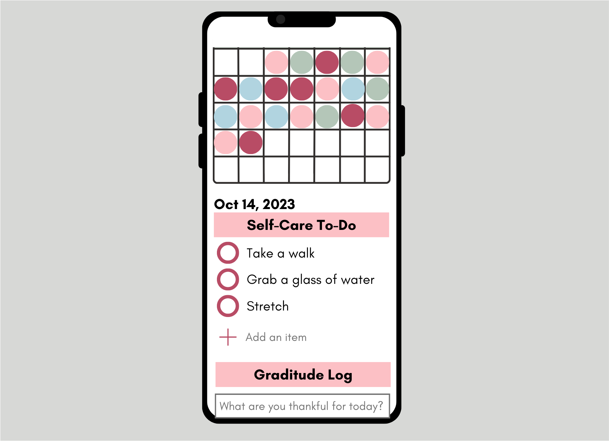

# Self Care App

The Self Care App is a mobile first application that allows the user to track their mood, use pre-made self care to-do checklists, edit the to-do checklist and log a graditude entry each day.

User Stories:
- Users can track mood with different mood options.
- Stored user data will create a mood map rendering on home screen
- Users can add or delete items from the to-do list
- Users can add, update or delete entries in the graditude section

## MVP

1. Functioning calendar with colors/emojis that corrispond to the dates.
2. Functioning to-do list where you can add tasks, and check them off when they are done.
3. Gratitude Journal where you can post and read gratitidue entries.

Below is an initial rendering with the general layout of the app.

## ERD and Schemas

There are 4 main tables each connected to the userID.
- The "userID" is the parent table, containing user information.
- The "dayObject" table has information about each mood for each day and is connected using the userID
- The "gratitude" 

## Resources

Calendar Tutorial:
https://www.educative.io/answers/how-to-create-an-animated-calendar-with-html-and-css

ISO convert to EST (convert date before saving)
https://stackoverflow.com/questions/10830357/javascript-toisostring-ignores-timezone-offset