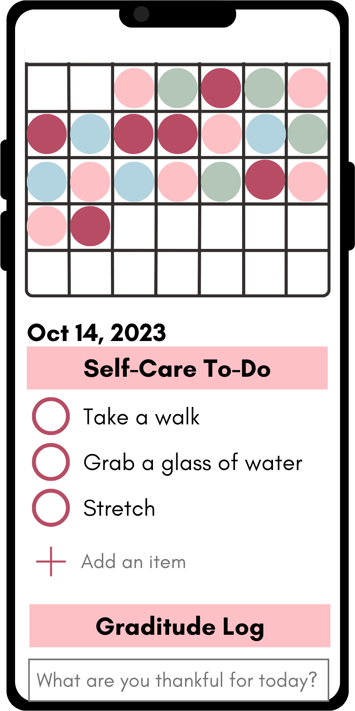
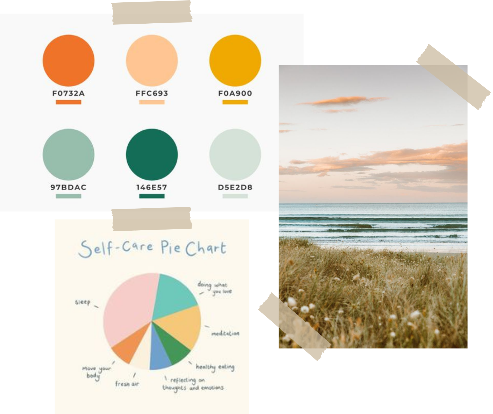
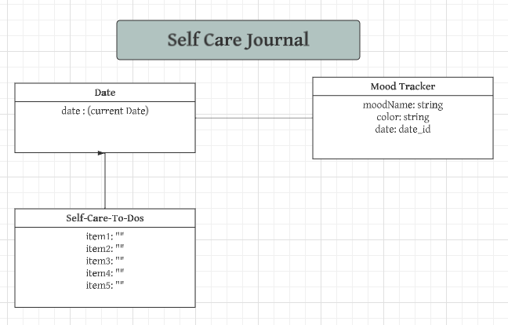

# Self Care App

The Self Care App is a mobile first application that allows the user to track their mood, use pre-made self care to-do checklists, edit the to-do checklist and log a graditude entry each day.

User Stories:
- Users can track mood with different mood options.
- Stored user data will create a mood map rendering on home screen
- Users can add or delete items from the to-do list
- Users can add, update or delete entries in the graditude section

## First Rendering

Below is an initial rendering with the general layout of the app.

Below is an initial color story for the look and feel of the app.

## Initial ERD

Below is a first draft of an ERD for the application.

