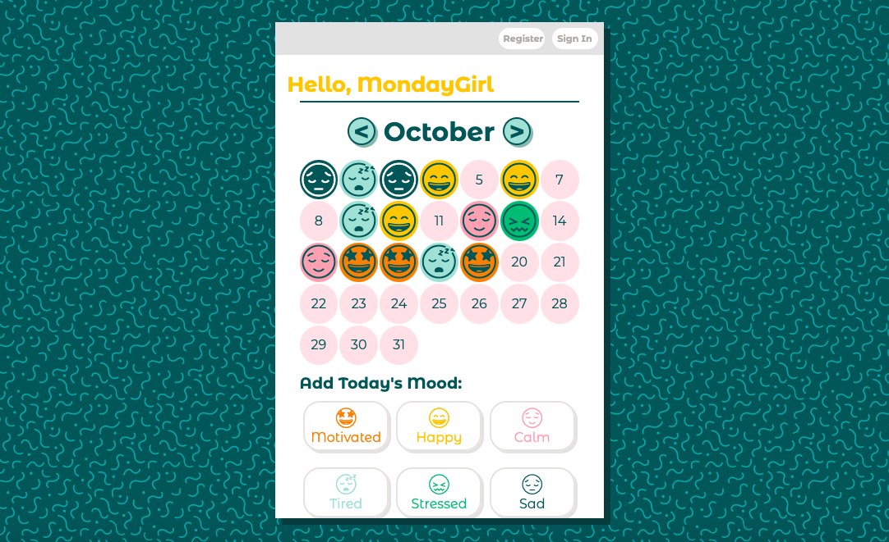

# Self Care App

The Self Care App is a mobile first application that allows the user to track their mood, use pre-made self care to-do checklists, edit the to-do checklist and log a graditude entry each day.

User Stories:
- Users can track mood with different mood options.
- Stored user data will create a mood map rendering on home screen
- Users can add or delete items from the to-do list
- Users can add, update or delete entries in the graditude section

## MVP

1. Functioning calendar with colors/emojis that correspond to the dates.
2. Functioning to-do list where you can add tasks, and check them off when they are done.
3. Gratitude Journal where you can post and read gratitidue entries.

## ERD and Schemas

There are 4 main collections each connected to the userID.
- The "userID" is the parent collection, containing user information.
- The "dayObject" collection has information about each mood for each day and is connected using the userID
- The "todo" collection stores the to do entry string, a default false setting for the isComplete key, the current date and the user id.
- The "gratitude" collection stores a gratitude journal entry, the current date and the user id.

## Implementation and Functionality

App functionality:
- The register button allows new users to create a new user profile.
- Currently, a test user is hard coded into the app, but there is a sign in button which will change the current user.
- The calendar displays the moods of the days and can display previous or upcoming months.
- The mood buttons below will update the current date with the selected mood.
- The Self Care checklist allows the user to add new tasks, check off the list when completed, and delete a task when done. The list shows all unchecked tasks from previous days as well as all tasks (checked or unchecked) from the current day.
- The Gratitude section allows the user to post a new entry and to edit current entries.

## Resources

Calendar Tutorial:
https://www.educative.io/answers/how-to-create-an-animated-calendar-with-html-and-css

ISO convert to EST (convert date before saving)
https://stackoverflow.com/questions/10830357/javascript-toisostring-ignores-timezone-offset